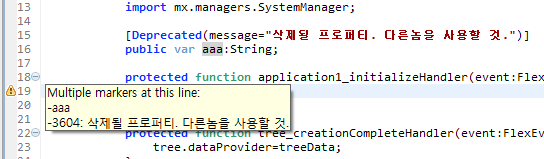
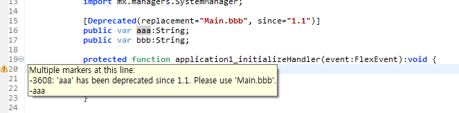
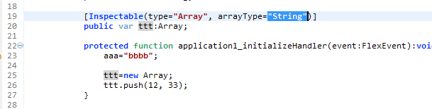
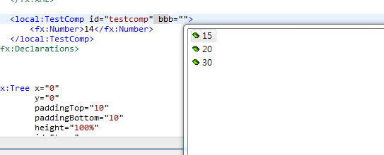
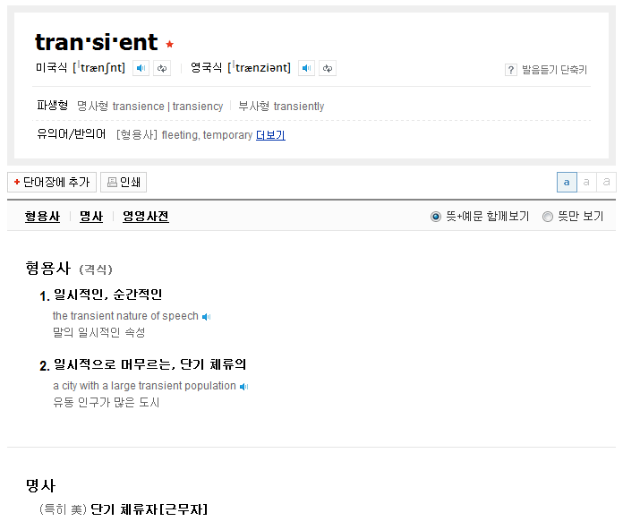

# property 에 추가 가능한 metadata tags

- `[Bindable]`
- `[Deprecated]`
- `[Embed]`
- `[Inspectable]`
- `[NonCommittingChangeEvent]`
- `[SkinPart]`
- `[Transient]`

## [Bindable]

하위로 알림을 내려줄 수 있는 Binding Object 로 변환시켜주는 기능
실 코드에서는 EventDispatch 기능을 베이스로 해서 작동된다.

mxmlc 의 컴파일에서 코드를 변형시킴으로서 구현되는 기능 중 한가지...

	// [Bindable]
	// [Bindable(event="eventname")]
	
	[Bindable]
	public var aaa:String;
	
	// mxmlc 컴파일러가 아래와 같이 해석해낸다
	public function get aaa():String {}
	public function set aaa(value:String):void {
	    dispatcheEvent("propertyChange");
	}

## [Deprecated]

곧 삭제되거나 할 api 에 대해서 사용하지 말 것을 권장하거나, 다른 api 로 유도할 때 사용한다. 프레임워크 관리자 급에서 사용될 수 있을만한 tip 이 될듯...

위와 같이 에러에 대한 메세지가 출력된다

위와 같이 replacement 와 since 만 입력해도 된다.

## [Embed]

특정 첨부파일을 코드상에 넣어준다. 컴파일 단계의 작동...

[file embeding](http://help.adobe.com/en_US/flex/using/WS2db454920e96a9e51e63e3d11c0bf69084-7fce.html)

Embed Tag Options

- global
	- `source="foo/foo.jpg"`
	- `mimeType="[type](http://help.adobe.com/en_US/flex/using/WS2db454920e96a9e51e63e3d11c0bf60546-7ffb.html#WS2db454920e96a9e51e63e3d11c0bf69084-7f96)"
		- types
			- application/octet-stream
			- application/x-font
			- application/x-font-truetype
			- application/x-shockwave-flash
			- audio/mpeg
			- image/gif
			- image/jpeg
			- image/png
			- image/svg
			- image/svg-xml
			
- images only
	- scaleGridTop, scaleGridBottom, scaleGridLeft, scaleGridRight="0"
	
- swf only
	- symbol="symbol name" : swf 내에 특정 심볼 호출

## [Inspectable]

Flex Component 를 만들때 GUI 상에서 속성등을 입력하는 창에 사용해준다.

Actionscript 상에서는 영향을 미치지 않는다.

arrayType 을 String 으로 지정한다해서 숫자형에 대한 에러가 나오는건 아니다.

다만, MXML 상에서는

	[Inspectable(type="Number", enumeration="15,30,20")]
	public var bbb:Object;

위와 같이 선언된 항목에 대해서는 아래와 같이 항목이 보이게 된다. (하지만, type="Number" 로 된 녀석에 대해서 String 을 입력하는 상황과 같은 타입 체크 에러는 발생하지 않는다. 해당 기능은 Flex GUI 속성창에 대한 가이드 기능만을 하는듯...)

MXML Component 를 만드는 상황에서 enumeration 을 통한 제한을 둬야 한다면 필요할듯...

<table>
<tr><th>Property</th><th>Type</th><th>Description</th></tr>
<tr><td>category</td><td>String</td><td>Groups the property into a specific subcategory in the Property inspector of the Flash Builder user interface. The default category is "Other". Specify a value of "Common", "Effects", "Events", "Layout Constraints", "Size", "Styles", "Text", or "Other".</td></tr>
<tr><td>defaultValue</td><td>String or Number</td><td>Sets the initial value in the editor that appears in the Property inspector when you modify the attribute. The default value is determined from the property definition.</td></tr>
<tr><td>enumeration</td><td>String</td><td>Specifies a comma-delimited list of legal values for the property. Only these values are allowed; for example, item1,item2,item3. Notice the lack of a space character between items so that Flex Builder does not interpret a space as a part of a valid value.  This information appears as code hints and in the Property inspector. If you define a Boolean variable, Flash Builder automatically shows true and false without you having to specifying them using enumeration.</td></tr>
<tr><td>environment</td><td>String</td><td>Specifies which inspectable properties should not be allowed (environment=none), which are used only for Flash Builder (environment=Flash), and which are used only by Flex and not Flash Builder (environment=MXML).</td></tr>
<tr><td>format</td><td>String</td><td>Determines the type of editor that appears in the Property inspector when you modify the attribute. You can use this property when the data type of the attribute is not specific to its function. For example, for a property of type Number, you can specify format="Color" to cause Flash Builder to open a color editor when you modify the attribute. Common values for the format property include "Length", "Color", "Time", "EmbeddedFile", and "File".</td></tr>
<tr><td>listOffset</td><td>Number</td><td>Specifies the default index into a List value.</td></tr>
<tr><td>name</td><td>String</td><td>Specifies the display name for the property; for example, FontWidth. If not specified, use the property’s name, such as _fontWidth.</td></tr>
<tr><td>type</td><td>String</td><td>Specifies the type specifier. If omitted, use the property’s type. The following values are valid: Array Boolean Color Font Name List Number Object String  If the property is an Array, you must list the valid values for the Array.</td></tr>
<tr><td>variable</td><td>String</td><td>Specifies the variable to which this parameter is bound.</td></tr>
<tr><td>verbose</td><td>Number</td><td>Indicates that this inspectable property should be displayed in the Flash Builder user interface only when the user indicates that verbose properties should be included. If this property is not specified, Flash Builder assumes that the property should be displayed.</td></tr>
</table>

## [NonCommittingChangeEvent]

쉽게 설명해서 `[Bindable]` 이 variable 에 적용했을때 getter, setter 로 변경하는데 비해,   
`[NonCommittingChangeEvent]` 는 변경을 하지 않는다.

둘 다, Binding 대상이 될 수 있다는 점에서는 차이점이 없지만,   
원본에 대한 변경을 가하지 않는다는 점에서는 유사.

다만, getter, setter 위에 적용된 `[Bindable]` 의 경우는 `[NonCommittingChangeEvent]` 와 사실상 차이가 없음.   
(수동으로 event 를 dispatch 해줘야 하기 때문에...)

원론적인 의미의 차이로 봐서, `[NonCommittingChangeEvent]` 가 "어떠한 이벤트시에 값을 새로 읽어 갱신하라." 라는   
갱신 시점의 자유도가 있다면, `[Bindable]` 의 경우에는 "값이 변경될 때 새로 읽어 갱신하라" 라는   
갱신 시점이 값이 변경될 때로 맞춰줘야 함.   
(기술적 구현상에서는 큰 차이가 없을지 몰라도, 원론적인 의미에서는 차이가 남)

주로 `TextInput.text`, `TextInput.htmlText`, `TextArea.text`, `TextArea.htmlText`, `ComboBase.text` 등에서 발견할 수 있음.

    [Bindable("htmlTextChanged")]
    [CollapseWhiteSpace]
    [Inspectable(category="General", defaultValue="")]
    [NonCommittingChangeEvent("change")]

    public function get htmlText():String
    {
        return _htmlText;
    }

    /**
     *  @private
     */
    public function set htmlText(value:String):void
    {
        textSet = true;
        if (!value)
            value = "";

        _htmlText = value;
        htmlTextChanged = true;

        _text = null;
        
        explicitHTMLText = value;

        invalidateProperties();
        invalidateSize();
        invalidateDisplayList();

        // Trigger bindings to htmlText.
        dispatchEvent(new Event("htmlTextChanged"));
    }

## [SkinPart]

SparkComponent skinning 에서 각 필요한 Skin 오브젝트들에 붙여주는듯...

	// spark.components.VideoPlayer 중 일부
    //--------------------------------------------------------------------------
    //
    //  Skin Parts
    //
    //--------------------------------------------------------------------------
    
    [SkinPart(required="true")]
    
    /**
     *  A required skin part that defines the VideoDisplay.
     *  
     *  @langversion 3.0
     *  @playerversion Flash 10
     *  @playerversion AIR 1.5
     *  @productversion Flex 4
     */
    public var videoDisplay:VideoDisplay;
    
    [SkinPart(required="false")]
    
    /**
     *  An optional skin part to display the current value of <code>codecurrentTime</code>.
     *  
     *  @langversion 3.0
     *  @playerversion Flash 10
     *  @playerversion AIR 1.5
     *  @productversion Flex 4
     */
    public var currentTimeDisplay:TextBase;
    
    [SkinPart(required="false")]
    
    /**
     *  An optional skin part for a button to toggle fullscreen mode.
     *  
     *  @langversion 3.0
     *  @playerversion Flash 10
     *  @playerversion AIR 1.5
     *  @productversion Flex 4
     */
    public var fullScreenButton:ButtonBase;
    
    [SkinPart(required="false")]
    
    /**
     *  An optional skin part for the mute button.  The mute 
     *  button has both a <code>muted</code> property and a 
     *  <code>volume</code> property.
     *  
     *  @langversion 3.0
     *  @playerversion Flash 10
     *  @playerversion AIR 1.5
     *  @productversion Flex 4
     */
    public var muteButton:MuteButton;

## [Transient]

정확한 용도 파악이 안됨.

어쨌든 Flex SDK 소스 내부에는 선언된 곳이 없음.   
Remoting 을 하는 과정에서 사용되는 듯...

# class 에 선언 가능한 녀석들

- `[AccessibilityClass]`
- `[Alternative]`
- `[Bindable]`
- `[DefaultProperty]`
- `[Deprecated]`
- `[Event]`
- `[Exclude]`
- `[ExcludeClass]`
- `[IconFile]`
- `[Managed]`
- `[RemoteClass]`
- `[ResourceBundle]`
- `[SkinState]`
- `[Style]`

## [AccessibilityClass]
## [Alternative]
## [DefaultProperty]
	
내부의 특정 variable 을 지정할 수 있고, MXML 로 사용되는 경우 tag 내부에 들어가는 기본적인 요소가 됨.

	[DefaultProperty("aaa")]
	public class TTT ...
	-----
	public var aaa:BitmapData
	-----
	<tt:TTT>{이 안에 들어갈 값이 aaa 가 되게 됨}</tt:TTT>
	
## [Event]
	
	[Event(name="eventName", type="package.eventType")]
	public class TTT....

Flash builder 가 읽어서 해당 instance 가 지원가능한 Event 목록을 만들어주게 되고,   
ASDoc 제작시에 지원 가능한 이벤트로 나오게 되므로....

Class 상에서 dispatchEvent 되는 모든 event 를 기재해주도록 하는것이 좋음.

## [Exclude]

`[Exclude(name="label", kind="property")]`

사용되지 않는 member 를 빼준다고 하지만... 막상 코딩할때 다 나옴... 별 효과없음...

## [ExcludeClass]

class 상에서 `@private` 으로 선언한 것과 동일한 효과가 있다함...   
결국 ASDoc 에 안나오게 되는 정도?

## [IconFile]

	[IconFile("MyButton.png")] 
	public class MyButton extends Button 
	{ 
	    ... 
	}
	
특정 component 를 제작시에 해당 component 가 Flash builder GUI component list 에    
어떤 모양으로 나올지를 결정하게 됨.

## [Managed]

## [RemoteClass]

BlazeDS 와 같은 RPC 기능을 사용시에 사용됨.

원격지의 Object 를 대리하는 대응 Class 가 됨.

## [ResourceBundle]

## [SkinState]

## [Style]

# interface 에 선언 가능한 녀석들

- `[ArrayElementType]`
- `[Bindable]`
- `[Deprecated]`
- `[Embed]`
- `[Inspectable]`
- `[NonCommittingChangeEvent]`
- `[PercentProxy]`
- `[RichTextContent]`
- `[SkinPart]`
- `[Transient]`

## [ArrayElementType]

MXML 사용시에 Array 내부에 들어갈 수 있는 속성들을 알려주게 됨...   
차라리 Vector 를 사용하는게 좋을듯...

## [PercentProxy]
## [RichTextContent]