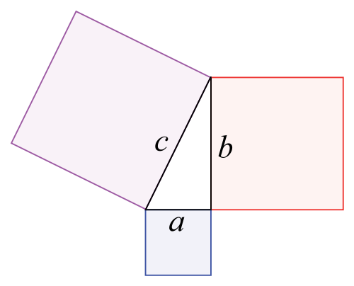

# 도, 분, 초 

- 1도 (degree) = 60분
- 1분 = 60초

# 직각삼각형

[위키피디아 피타고라스의 정리](http://ko.wikipedia.org/wiki/%ED%94%BC%ED%83%80%EA%B3%A0%EB%9D%BC%EC%8A%A4%EC%9D%98_%EC%A0%95%EB%A6%AC)

> 각 변의 길이로 다른 변의 길이 구하기   
> a2 + b2 = c2

	c^2 = a^2 + b^2
	c^2 - a^2 = b^2
	
	// C 와 A (or B) 를 가지고 B (or A) 를 구한다
	private function pythagorasGetAB(c : Number = 0, ab : Number = 0) : Number {
		return Math.sqrt(Math.pow(c, 2) - Math.pow(ab, 2));
	}
	
	// A 와 B 를 가지고 C 를 구한다
	private function pythagorasGetC(a : Number = 0, b : Number = 0) : Number {
		return Math.sqrt(Math.pow(a, 2) + Math.pow(b, 2));
	}

[위키피디아 직각삼각형](http://ko.wikipedia.org/wiki/%EC%A7%81%EA%B0%81%EC%82%BC%EA%B0%81%ED%98%95)

> 변의 길이와 각도로 다른 변의 길이 구하기   
> 높이 = 밑변 * (밑변 각도 / 45)   
> 밑변 = 높이 * (밑변 각도 / 45)

	private function getAB(ab : Number, degree : Number) : Number {
		return ab * (degree / 45);
	}
	
각 변의 길이 구하기

	var a : int = 5;
	var b : int = 5;
	var c : Number = Math.sqrt(Math.pow(a, 2) + Math.pow(b, 2));
	
	var s : Number = b / c;
	var t : Number = b / a;
	
	tracer("조건들 a, b, c, s, t", a, b, c, s, t);
	
	trace("밑변 a 의 길이로 높이 b 찾기", t * b);
	trace("높이 b 의 길이로 밑변 a 찾기", b / t);
	trace("높이 b 의 길이로 빗변 c 찾기", b / s);
	trace("빗변 c 의 길이로 높이 b 찾기", s * c);
	trace("밑변 a 와 높이 b 로 빗변 c 찾기", Math.sqrt(Math.pow(a, 2) + Math.pow(b, 2)));
	trace(Math.sin(MathEx.RADIAN[45]), b/c);
	

> tan(각도 b) = 높이 (b) / 밑변 (a)    
> 각도 b = MathUtils.radToDeg(Math.atan(b / a))    
> 각도 a = 90 - 각도 b
