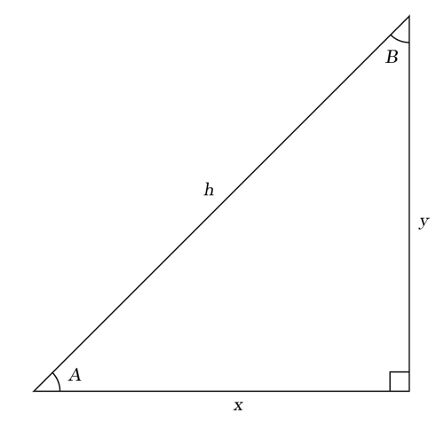

# Chapter01 각도와 삼각형 
# Chapter02 직각삼각형 문제를 풀다 
# Chapter03 삼각함수: 사인(sin) 코사인(cos), 탄젠트(tan)

- `s = y / h` A 를 기준으로 하는 sin 비율
- `t = y / x` A 를 기준으로 하는 tan 비율
- `x = y / t`
- `x = Math.sqrt(Math.pow(h, 2) - Math.pow(y, 2))`
- `y = t * x`
- `y = s * h`
- `y = Math.sqrt(Math.pow(h, 2) - Math.pow(x, 2))`
- `h = y / s`
- `h = Math.sqrt(Math.pow(x, 2) + Math.pow(y, 2))`
- `Math.pow(h, 2) = Math.pow(x, 2) + Math.pow(y, 2)` 

사인, 코사인, 탄젠트는 각 변의 비율을 이야기 한다.   
`사인 비율 = 반대 변 / 빗변`   
`코사인 비율 = 이웃 변 / 빗변`    
`탄젠트 비율 = 반대 변 / 이웃 변`   
이를 정리하면 아래와 같은 공식이 정리되게 된다

- `Math.sin(A) = y / h` A 와 B 는 radian 각도 단위이다
- `Math.cos(A) = x / h`
- `Math.tan(A) = y / x`
- `Math.sin(B) = x / h`
- `Math.cos(B) = y / h`
- `Math.tan(B) = x / y`

그리고, 이에 따라 정의되는 공식들

- `x = h * Math.cos(A)`
- `y = h * Math.sin(A)`

- `Math.tan(A) = Math.sin(A) / Math.cos(A)`

각도, 이웃 변, 반대 변, 빗변 중 2개의 정보가 있으면 모든 값을 계산해 내는 것이 가능하다?   
경우의 수는 6가지?

- 각도(A) + 이웃 변(x)
	- 반대 변(y) = `Math.tan(A) * x`
	- 빗변(h) = `x / Math.cos(A)`
	
- 각도(A) + 반대 변(y)
	- 이웃 변(x) = `y / Math.tan(A)`
	- 빗변(h) = `y / Math.sin(A)`
	
- 각도(A) + 빗변(h)
	- 이웃 변(x) = `Math.cos(A) * h`
	- 반대 변(y) = `Math.sin(A) * h`
	
- 이웃 변(x) + 반대 변(y)
	- 빗변(h) = `Math.sqrt(Math.pow(x, 2) + Math.pow(y, 2))`
	- 각도(A)
	
- 이웃 변(x) + 빗변(h)
	- 반대 변(y)= `Math.sqrt(Math.pow(h, 2) - Math.pow(x, 2))`
	- 각도(A)

- 반대 변(y) + 빗변(h)
	- 이웃 변(x) = `Math.sqrt(Math.pow(h, 2) - Math.pow(y, 2))`
	- 각도(A)

## page 86 물체 까지의 거리 구하기

	y = s / 2
	x = y / Math.tan(A)
	
	trace("d = " + x)
	
## page 87 언덕 높이 구하기

	y1 = h
	x = y1 / Math.tan(B)
	y2 = Math.tan(A) * x
	
	trace("t = " + (y2 - y1))
	
## page 88 언덕 높이 구하기

	
	

# Chapter04 삼각함수의 응용 
# Chapter05 호도법(라디안 각도) 
# Chapter06 삼각함수 항등식 
# Chapter07 사인법칙과 코사인법칙 
# Chapter08 삼각함수 그래프 
# Chapter09 파동 
# Chapter10 삼각함수의 역함수 
# Chapter11 극 좌표계 
# Chapter12 복소수 
# Chapter13 좌표계 회전 변환과 원뿔 곡선 
# Chapter14 구면 삼각법 
# Chapter15 sin x와 cos x의 다항식 근사 